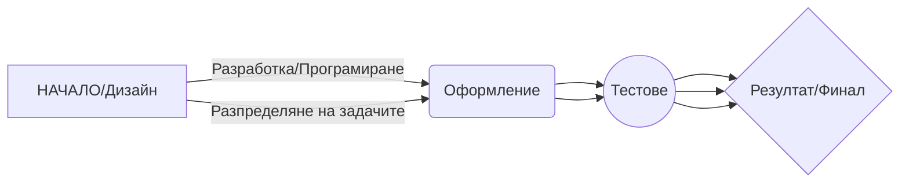

# Екологосъобразна Система за Управление на Трафика

В  свят, в  който  се  пресичат  технологичният  напредък  и  екологичното  съзнание, се  сблъскваме  с  неотложната  нужда  от  изобретателни  софтуерни  решения, които  да  служат  както  на  обществото, така  и  на  нашата  планета. Този  проект  има  за  цел  да  създаде  революционно  софтуерно  приложение, което  да  промени  начина, по  който  взаимодействаме  с  градската  среда, и  да  насърчи  екологосъобразния  начин  на  живот. Използвайки  усъвършенствани  технологии, включително  бази  данни, SQL  Server  Management  Studio (SSMS), Visual  Studio  2022/VS  Code  и  различни  среди  за  програмиране, Sustainable  City  Navigator (SCN) обещава  да  промени  правилата  на  играта. В  тази  документация  са  разгледани  обширната  концепция  на  проекта, многостранната  му  функционалност  и  подробните  стъпки  за  изпълнение.

### Описание  на  проекта
##### Концепция

Проектът  SCN  се  основава  на  амбициозната  визия  за  създаване  на  цялостна  и  устойчива  градска  навигационна  система, която  да  съчетава  технологични  иновации, екологична  отговорност  и  градска  ефективност. Тази  многостранна  система  се  състои  от  множество  модули, всеки  от  които  допринася  за  постигането  на  общата  цел  за  създаване  на  екологични  градове:

1. **Екологосъобразно  маршрутизиране  на  трафика:** Разработване  на  алгоритъм  за  динамично  маршрутизиране, който  дава  приоритет  на  екологичните  видове  транспорт, независимо  дали  става  въпрос  за  електрически  превозни  средства, обществен  транспорт  или  колоездене, като  същевременно  намалява  задръстванията  и  въздействието  върху  околната  среда. Маршрутизацията  на  тази  система, управлявана  от  изкуствен  интелект, отчита  данните  за  трафика  в  реално  време, метеорологичните  условия  и  енергийно  ефективните  маршрути.
2. **Усъвършенстване  на  обществения  транспорт:** Целта  ни  е  да  направим  революция  в  обществения  транспорт  чрез  интегриране  в  реално  време  с  платформата  SCN. Това  включва  мобилно  издаване  на  билети, проследяване, прогнозиране  на  времето  за  пристигане  и  стимули  за  екологични  практики  за  придвижване.
3. **Управление  на  енергията  и  проследяване  на  въглеродните  емисии:** Използване на  интелигентни  градски  технологии  за  наблюдение  на  потреблението  на  енергия, въглеродните  емисии  и  използването  на  ресурси. Тези  данни  ще  се  използват  за  наблюдение  в  реално  време, за  насърчаване  на  пестенето  на  енергия  и  за  улесняване  на  градското  планиране  с  цел  намаляване  на  въглеродния  отпечатък.
4. **Ангажиране  на  общността:** Изграждане  на  динамично, удобно  за  ползване  мобилно  приложение  и  онлайн  платформа  за  жителите  и  посетителите. Платформата  ще  предлага  интерактивни  функции, като  например  игровизация  на  екологичното  придвижване  до  работа, споделени  пътувания  и  инициативи  за  устойчивост, които  се  предлагат  от  потребителите.
5. **Сензори  за  качеството  на  въздуха  и  околната  среда:** Разполaгане на  редица  IoT сензори в  целия  град, за  да  осигуряване на  данни  за  качеството  на  въздуха  и  околната  среда  в  реално  време. SCN  ще  предприеме  действия  чрез  пренасочване  на  трафика  и  изпращане  на  предупреждения  в  периоди  с  лошо  качество  на  въздуха.
6. **Интелигентно  паркиране  и  трафик:** Използване на  свързаната  с  IoT  инфраструктура  за  паркиране, за  да се  намали  задръстванията, замърсяването  и  времето, прекарано  в  търсене  на  места  за  паркиране. SCN  ще  помогне  на  потребителите  да  намерят  ефективно  място  за  паркиране  и  ще  им  предложи  варианти  за  съвместно  ползване  на  автомобил.

##### Функционалност
#### Екологосъобразно  маршрутизиране  на  трафика: 
- Прилагане  на  най-съвременни  алгоритми  и  обработка  на  геопространствени  данни  за  предоставяне  на  динамични  опции  за  екомаршрути  на  потребителите.  
  
- Използване на  прогнозни  анализи, за  да  се предложат  оптимални  часове  за  тръгване  за  екологични  варианти  за  придвижване, като  се сведе  до  минимум  времето  за  чакане.

#### Подобрения  на  обществения  транспорт:
- Създаване на  всеобхватно  мобилно  приложение  с  информация  за  обществения  транспорт  в  реално  време, мобилни  билети  и  награди  за  екологично  пътуване.  
  
- Даване на  възможност  на  потребителите  да  оценяват  услугите  на  обществения  транспорт  и  да  предлагат  подобрения.

#### Управление  на  енергията  и  проследяване  на  въглеродните  емисии:
- Инсталиране  на  интелигентни  измервателни  уреди  и  сензори  за  наблюдение  на  потреблението  на  енергия  и  въглеродните  емисии  в  целия  град.  
  
- Представяне на  тези  данни  в  удобни  за  ползване  информационни  табла, като  се дава  възможност  на  градовете  и  отделните  хора  да  намалят  своя  въглероден  отпечатък.

#### Ангажираност  на  общността:
- Разработване  на  привлекателна  социална  платформа, чрез  която  потребителите  да  споделят  инициативи  за  устойчивост  и  да  се  състезават  за  награди  за  екологично  пътуване.  
  
- Предлагане на  предизвикателства  в  реално  време, като  например  състезания  за  съвместно  ползване  на  автомобил, за  да  се мотивират  потребителите  да  избират  устойчиви  варианти.

#### Сензори  за  качество  на  въздуха  и  околната  среда:
- Разгръщане  на  широка  мрежа  от  сензори  IoT  за  събиране  на  данни  за  качеството  на  въздуха  и  околната  среда.  
  
- Автоматизиране на  пренасочването  на  трафика  и  изпращане на  предупреждения  на  потребителите  в  периоди  с  лошо  качество  на  въздуха.

#### Интелигентно  паркиране  и  поток  на  трафика:
- Даване на  възможност  на  свързаните  с  IoT  паркинги  да  предоставят  наличност  и  възможности  за  резервация  в  реално  време.  
  
- Предлагане  на  възможности  за  съвместно  пътуване  с  автомобил  въз  основа  на  близостта  и  дестинациите  на  потребителите.

### Изпълнение  на  проекта
За  осъществяването  на  този  визионерски  проект  ще  бъдат  използвани  следните  инструменти  и  технологии:  
  
- **SQL  Server  Management  Studio (SSMS):** За  управление  на  сложна  структура  на  база  данни, съхраняваща  геопространствени  данни  и  данни  за  околната  среда.  
  
- **Visual  Studio  2022/VS  Code:** За  разработване  на  многофункционално  мобилно  приложение  с  разширени  функционалности.  
  
- **C#  и  SQL:** Основни  езици  за  програмиране, използвани  за  разработване  на  софтуер, управление  на  бази  данни  и  бекенд  логика.  
  
- **Устройства  и  сензори  на  IoT:** За  събиране  на  данни  за  околната  среда, информация  за  пътния  поток  и  наличността  на  места  за  паркиране.  
  
- **Услуги  за  геопространствени  данни (напр. GIS):** За  алгоритми  за  обработка  на  геопространствени  данни  и  маршрутизиране.

### Ползи  от  проекта
Проектът  SCN  обещава  безброй  ползи, които  обхващат  аспектите  на  обществото, околната  среда  и  градското  управление:  
  
- **Екологосъобразни  градове:** Проектът  предвижда  градове  с  намалено  замърсяване, енергийно  ефективно  придвижване  и  намалени  задръствания.  
  
- **Ефективен  градски  живот:** Подобреният  обществен  транспорт, интелигентното  паркиране  и  съкратеното  време  за  придвижване  повишават  цялостното  качество  на  градския  живот.  
  
- **Намаляване  на  въглеродния  отпечатък:** Проследяването  на  въглеродните  емисии  и  усилията  за  опазване  на  околната  среда  допринасят  за  по-зелена  планета.  
  
- **Ангажираност  на  общността:** Потребителите  стават  активни  участници  в  устойчивото  развитие, като  насърчават  чувството  за  общност  и  споделена  отговорност.  
  
- **Вземане  на  информирани  решения:** Данните  в  реално  време  дават  възможност  на  градовете  и  хората  да  вземат  информирани  решения, съобразени  с  околната  среда.

### Заключение
Проектът  Sustainable  City  Navigator (SCN) надхвърля  традиционните  системи  за  навигация  в  града, като  интегрира  екологично  съзнание, технологични  иновации  и  ангажираност  на  общността. Използвайки  SQL, SSMS, Visual  Studio  и  технологиите  на  IoT, системата  е  подготвена  за  надеждно  и  ефективно  внедряване. Тази  документация  предоставя  обширен  преглед  на  обширната  концепция  на  проекта, многостранната  му  функционалност  и  широкообхватните  ползи, като  създава  предпоставки  за  иновативна  и  добре  документирана  устойчива  градска  навигационна  система, която  ни  води  към  по-зелено  бъдеще.

### SQL  Server  Management  Studio (SSMS):
**Част, използваща  SSMS:** Управлението  на  базата  данни  на  проекта, включително  съхраняването  на  геопространствени  данни  и  данни  за  околната  среда, ще  се  извършва  с  помощта  на  SSMS. Това  включва  създаването  и  управлението  на  сложна  структура  от  бази  данни  за  съхраняване  на  съответните  данни, като  например  качеството  на  въздуха, трафика, потреблението  на  енергия  и  въглеродните  емисии.
**Защо  SSMS:** 
SSMS  е  мощен  и  широко  използван  инструмент  за  управление  на  бази  данни  на  Microsoft  SQL  Server. Той  предоставя  удобен  за  потребителя  интерфейс  за  проектиране, създаване  и  управление  на  бази  данни, което  го  прави  подходящ  за  справяне  с  обширните  изисквания  за  данни  на  проекта.

### Visual  Studio  2022/VS  Code:
**Част  Използване  на  Visual  Studio:** 
Разработването  на  многофункционално  мобилно  приложение  с  разширени  функционалности, включително  потребителски  интерфейс, алгоритми  за  маршрутизиране  и  интеграция  с  различни  модули, ще  бъде  извършено  с  помощта  на  Visual  Studio  2022/VS  Code.  
  
**Защо  Visual  Studio:** 
Visual  Studio  е  водеща  интегрирана  среда  за  разработка (IDE) за  създаване  на  широк  спектър  от  приложения, включително  мобилни  приложения. Той  предлага  обширни  инструменти  за  кодиране, отстраняване  на  грешки  и  създаване  на  потребителски  интерфейси, което  го  прави  идеален  за  разработване  на  мобилното  приложение  на  проекта.

### C#  и  SQL:
**Част  Използване  на  C#:** 
C#  ще  служи  като  основен  език  за  програмиране  за  разработване  на  софтуер, включително  за  създаване  на  логиката  на  мобилното  приложение, интегриране  със  сензори  и  прилагане  на  алгоритми  за  маршрутизация.  
  
**Защо  C#:** 
C#  е  универсален  език  за  програмиране, известен  със  своята  простота  и  пригодност  за  създаване  на  приложения  за  различни  платформи, включително  мобилни  приложения. Той  е  подходящ  за  разработване  на  мобилното  приложение  на  проекта.  
  
**Част  Използване  на  SQL:** 
SQL  ще  се  използва  за  управление  на  сложната  база  данни  на  проекта, за  съхраняване  на  геопространствени  и  екологични  данни  и  за  обработка  на  заявки  за  извличане  и  анализ  на  данни.  
  
**Защо  SQL:** 
SQL (Структуриран  език  за  заявки) е  стандартният  език  за  управление  и  заявки  към  релационни  бази  данни. Той  е  от  съществено  значение  за  съхраняването  и  извличането  на  големи  обеми  структурирани  данни, което  е  неразделна  част  от  подхода  на  проекта, ориентиран  към  базата  данни.

### Устройства  и  сензори  на  IoT:
**Част, използваща  устройства  на  IoT:** 
Ще  бъдат  разположени  устройства  и  сензори  на  IoT (интернет  на  нещата) за  събиране  на  данни  за  околната  среда  в  реално  време, измерване  на  качеството  на  въздуха, данни  за  пътния  поток  и  наличността  на  паркинги.  
  
**Защо  устройствата  на  IoT:** 
Устройствата  на  IoT  осигуряват  възможности  за  събиране  на  данни  и  комуникация  в  реално  време. Те  са  от  решаващо  значение  за  наблюдението  на  качеството  на  въздуха, условията  на  трафика  и  наличието  на  паркинги, като  допринасят  за  динамичните  процеси  на  вземане  на  решения  в  рамките  на  проекта, основани  на  данни.

### Услуги  за  геопространствени  данни (напр. ГИС):
**Част, в  която  се  използват  услуги  за  геопространствени  данни:** 
Услугите  за  геопространствени  данни  ще  се  използват  за  обработка  на  геопространствени  данни, географско  ограждане  и  алгоритми  за  маршрутизиране, които  са  от  съществено  значение  за  екологосъобразното  маршрутизиране  на  трафика  по  проекта  и  свързаните  с  него  функции.  
  
**Защо  услуги  за  геопространствени  данни:** 
Услугите  за  геопространствени  данни, като  например  географските  информационни  системи (ГИС), са  специализирани  инструменти  за  управление  и  анализ  на  географски  данни. Те  позволяват  на  проекта  да  обработва  ефективно  пространствени  данни, включително  изчисляване  на  оптимални  маршрути  и  геопространствен  анализ, което  е  от  решаващо  значение  за  екологосъобразното  маршрутизиране  на  трафика  и  свързаните  с  него  функции.

В обобщение, проектът ще използва SQL Server Management Studio (SSMS) за управление на бази данни, Visual Studio 2022/VS Code за разработване на мобилни приложения, C# и SQL за софтуерна логика и взаимодействие с бази данни, устройства и сензори на IoT за събиране на данни в реално време и услуги за геопространствени данни за геопространствен анализ и алгоритми за маршрутизиране. Тези инструменти и технологии са подбрани въз основа на техните специфични възможности и пригодност за всеки аспект на проекта, което гарантира ефикасно и ефективно изпълнение.

